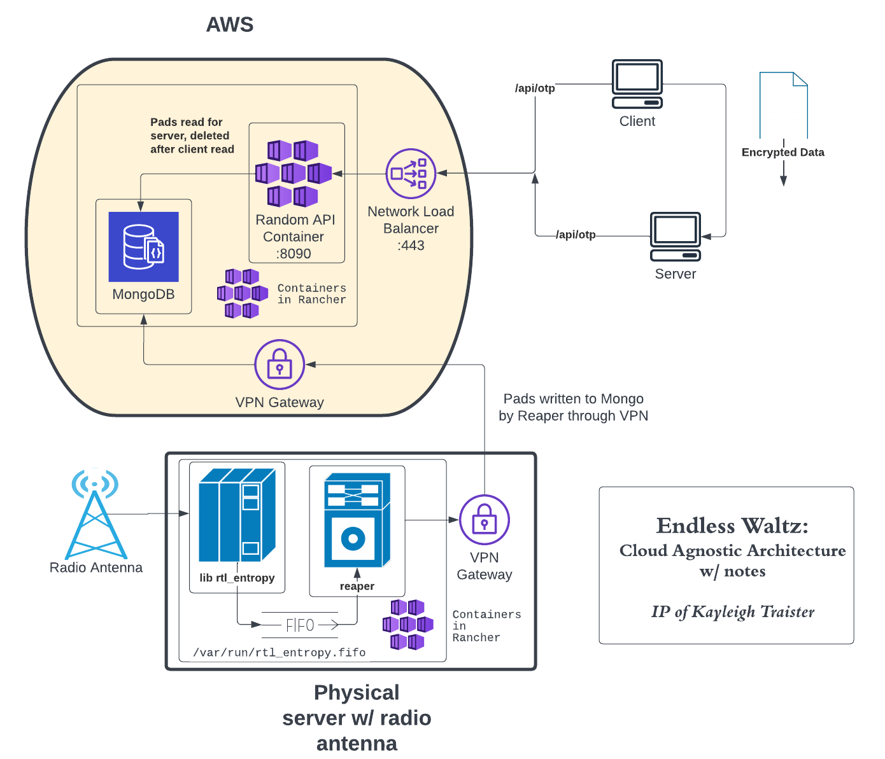

# endless_waltz

POC in python, working code in go
----------------------------------

## Phase I
### just create something
***Complete :)***
- [x] implement api, server, and client
- [x] implement xor and pad code
- [x] implement redis for caching

## Phase II
### get basic functionality working in GoLang
***Complete :)***
- [x] rewrite API in Go
   - moved UUID generation for connection from server into API
- [x] implement xor library
   - having a prototype made this way easier
   - need xor lib to pass around strings
   - need xor lib to import smoothly
- [x] rewrite Server in Go
   - server is working up to after a pad is requested and UUID sent to client
- [x] rewrite Client in Go
   - need one set of random APIs to garuntee MITM attacks are mitigated
- [x] create dockerfiles to host each component
- [x] add configuration to daemons 
- [x] get the compose file working for local dev
- [x] cleanup output from containers, useful logging
- [x] fix conn.close on server/client transaction
- [x] add flags to send message to client
- [x] Remove Redis and update to use Mongo
- [x] Add API route to upload pads -- make the service cloud agnostic!!!
   - Mongo should be used to store pads as well (!!!)
- [x] API Refactor
   - [x] remove upload routes, this is moving to reaper
   - [x] move configuration to env variables 
- [x] Reaper refactor
   - [x] reaper should write directly to database (will add items to P3)
   - [x] reaper logging should be useful (lol)
   - [x] reaper should read from env variables for serversMap to upload to
- [x] Get API/Reaper working on local for testing!!! Consistent endpoint for API...   
   - yes, I'm taking time to celibrate :) 
- [x] add DH handshake!!
   - dh handshake with rediculous values will be used for pad transformation and message signing
- [x] **CODE CLEANUP** 
   - BEFORE PROCEEDING:
   - [x] ensure all dead code is removed
   - [x] make sure server/api/client do not quit prematurely
   - [x] implement at least basic unit test coverage -- run on commit
      - [x] server
      - [x] reaper
      - [x] random
      - [x] common
         - [x] dh.go
         - [x] xor.go
      - [x] client

## Phase III
### get something working with hardware to deploy to cloud
***10% Complete***
- [x] order hardware
- [x] confirm operation of ew-rtl-entropy binary and containerize
   - need to make sure this binary will work, output works, containerize
- [x] write reaper in Go to live on physical hardware
   - reaper will depend on a C executable for RNG using an SDR for randomness
   - [x] Make a pipe inside a volume and mount it on `/dev/urandom` where the Go lib reads -- dont fight it lol
   - reaper and ew-rtl-entropy are working together in docker -- compose file works
- [ ] setup automation for CI/CD
   - GitHub Actions is the easiest and closest, and I'm already paying for pro - try this first
   - Setup for CI DONE! For:
     - [x] Reaper
     - [x] API
     - DEFER Server- plain Go executable (terraform-esque)
     - DEFER Client - plain Go executable (terraform-esque)
   - CD not yet started...
     - [ ] Start CD when public endpoints are up
- [x] k8s - fuck helm charts for services - init files for below
   - [x] refactor reaper helm chart to be plain yaml
      - TBH... I'm not really a fan of helm :( Let's use Service/Kustomize instead
- UMM setup API keys for random server to be used for pad persistance
   - [ ] What was I fucking thinking when I wrote this...?
   - API keys will be optional, but old pads will be cleaned up without the key being used
   - thats some primo encryption
- [ ] add item locking to mongo in api -- line 80 in random.go
- [ ] start padding the message with random data to prevent length attacks
   - pad should be random, use delimeter like "###" to signify padding
- [ ] further logging improvements
- DEFER: alignment of code/infra paradigms?
   - [ ] change server config method from file to vars for ease-of-use?
   - [ ] check code base for contraditing methadologies  
- DEFER: create infrastructure for project in AWS
   - [ ] Answer: When do we want to expose a public endpoint?
   - terraform IAC for non-k8s resources

### At this point, we're ready for the deepweb and linux users

## Architecture

## Phase IV
### needed to make the tech accesible
- [ ] Write Desktop application for client and server
- [ ] setup website
- [ ] need Android client
   - ugh. This is gonna be intense
   - To make it accessable, it needs to work easily on your phone. Workflow may look like
     - Sally opens app. Tunnel to server established.
     - Betty is offline. Sally pings Betty.
     - Betty opens app, establishes unique tunnel to server
     - apps perform DH, get pad, send message
     - tunnels are closed, msg deleted
- [ ] needs IOS client
- [ ] turn it loose

