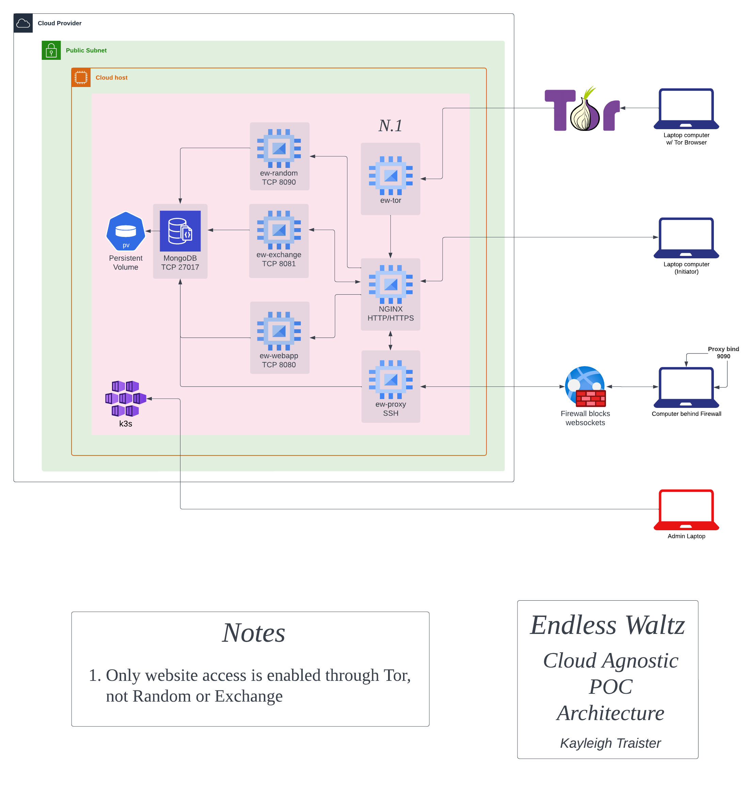

### Purpose
This project is intended to serve as a POC of a One-Time Pad implementation using a Diffie-Hellman handshake to modify pads sent across the open internet. This monorepo contains all parts of the system except `ew-rtl-entropy`.

## Architecture
**This is out of date and needs to be updated**

