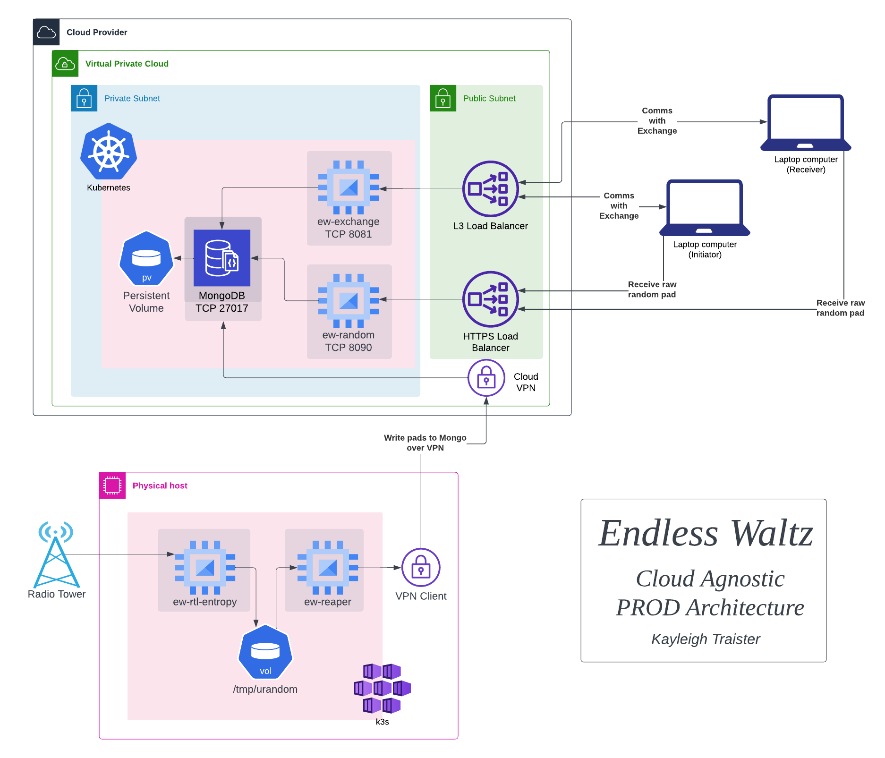

### Infrastructure
This directory contains all of the scripts and manifests to build the physical
hosts and cloud hosts required for the EW infrastructure. At the time of 
writing, the POC infrastructure is active, and no Terraform yet exists. 

This directory is split out into three discreet sections: nginx, bare_metal,
and k8s. 

## NGINX
This directory contains configuration files used for the NGINX service. For 
more information, consult [the NGINX README.md](./nginx/README.md)

## Tor
This directory contains configuration files and the dockerfile for the Tor 
client service. There is no entry/exit node configuration, just a simple
client config to create a `.onion` website for EW. For more information, 
consult [the Tor README.md](./tor/README.md)

## Bare Metal
This section outlines how to set up new k3s hosts. 
This should only be needed if we take a step back from managed k8s services. 
Below is some legacy code that was removed by the Kyber refactor :) 
```
Rache Bartmoss FTW
### Physical Host
Reaper hosts can be any machine with at least 1 core, 2G of ram, and USB port.
The Reaper host will require an `RTL2832U OEM SDR` with an antenna to collect 
atmospheric randomness used for one-time pad generation. 

### Software
EW's architecture requires only k3s and a VPN client to be installed on the
reaper host. Scripts are provided in this directory to do the heavy lifting. 
Install Ubuntu 22.04 on your new reaper host, and follow the directions in 
[the Bare Metal README.md](./bare_metal/README.md)

ToDo: Improve randomness antenna setup (grounding, vaccume tube)
```

## K8s
This section has the service files that define the state for the k8s services.
These files will be applied on our new cloud infra! To finish. follow the directions 
in the [the K8s Infra README.md](./k8s/README.md)

### Firewall
The current architecture has the exposed nginx service running on 80, 443, and 8080.
This is required in order to redirect traffic from one node to another, but
also opens the possiblitiy of external clients hitting the load balancer on port 80. 
This should not be allowed. Inbound access should be limited at the firewall
```
Allowed Ports:
  80 - NGINX HTTPS redirect
 443 - NGINX HTTPS
2222 - EW-Proxy 
```

## Architecture
### Current (POC)
The POC Infra is currently active. It is true to this diagram:


### Future (Production)
The PROD Infra is not yet active. It will be more expensive, but truly HA. 
This is the current idea of what it will look like:


