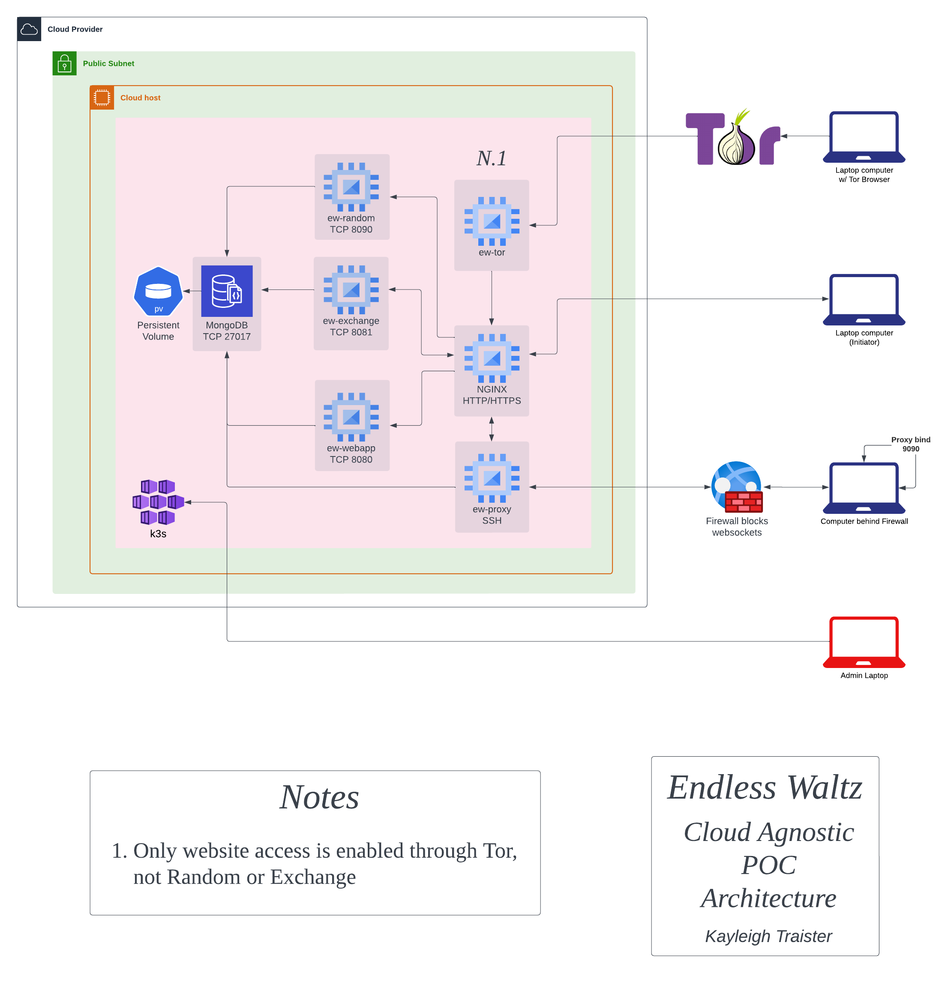

### Infrastructure
This directory contains all of the scripts and manifests to build the physical
hosts and cloud hosts required for the EW infrastructure. At the time of 
writing, the POC infrastructure is active, and no Terraform yet exists. 

This directory is split out into two discreet sections: bare_metal and k8s. 

## Bare Metal
This section outlines how to set up new reaper physical hosts. 

### Physical Host
Reaper hosts can be any machine with at least 1 core, 2G of ram, and USB port.
The Reaper host will require an `RTL2832U OEM SDR` with an antenna to collect 
atmospheric randomness used for one-time pad generation. 

### Software
EW's architecture requires only k3s and a VPN client to be installed on the
reaper host. Scripts are provided in this directory to do the heavy lifting. 
Install Ubuntu 22.04 on your new reaper host, and follow the directions in 
[the Bare Metal README.md](./bare_metal/README.md)

ToDo: Improve randomness antenna setup (grounding, vaccume tube)

## K8s
This section has the service files that define the state for the k8s services.
These files will be applied on new reaper hosts, and also cloud infra!
To finish a new Reaper box or deploy new infra, follow the directions in 
[the K8s Infra README.md](./k8s/README.md)

## Architecture
### Current (POC)
The POC Infra is currently active. It is true to this diagram:

### Future (Production)
The PROD Infra is not yet active. It will be more expensive, but truly HA. 
This is the current idea of what it will look like:

